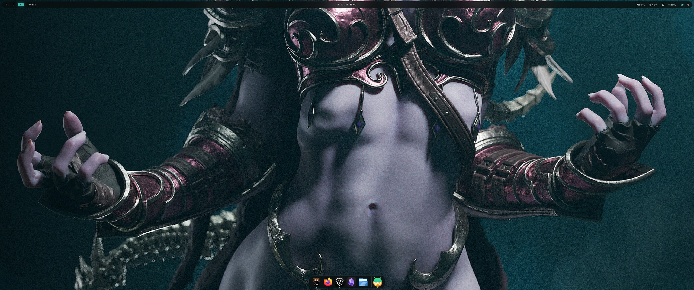
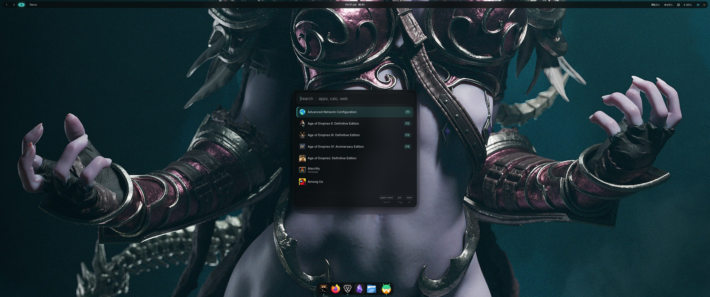
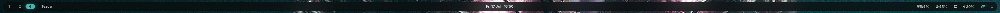

<h1 align="center">Tezca</h1>

<p align="center">
  <em>An elegant, performance-first Hyprland desktop environment.</em><br>
  <strong>Obsidian aesthetic · Rust core · CSS soul · NVIDIA-native.</strong>
</p>

<p align="center">
  
</p>

---

**Tezca** (← *Tezcatlipoca*, the Aztec god of the obsidian **smoking mirror**) is a
curated, macOS-15-inspired Hyprland desktop tuned to be correct and buttery on
**NVIDIA + dual-165 Hz** out of the box, beautiful through a single
wallpaper-driven theme engine, and built around a small **Rust core** so it stays
maintainable.

It's opinionated on purpose — not a pile of dotfiles, but a cohesive DE for
**gaming · AI · dev · hanging out**.

> Full rationale, decisions, and roadmap live in [`docs/DESIGN.md`](docs/DESIGN.md).

## Aesthetic — the "Smoking Mirror"

- **Obsidian** — deep near-black base, volcanic-glass surfaces.
- **Mirror** — translucency, blur, subtle sheen (macOS Sequoia glass).
- **Smoke** — soft graded greys, gentle shadows, nothing hard-edged.
- **Accent** — turquoise/jade `#3FB8AF`, used sparingly, with obsidian-gold secondary.

## Gallery

<p align="center">
  
</p>
<p align="center">
  
</p>

## Highlights

- **NVIDIA-correct session** — uwsm-managed env, explicit sync, `nvidia_drm.modeset`,
  fullscreen VRR, per-monitor workspaces on dual 165 Hz. `tezca doctor` verifies it all.
- **One wallpaper drives every color** — [matugen](https://github.com/InioX/matugen)
  extracts a Material-You palette and re-skins Waybar, swaync, Walker, kitty, Hyprland
  borders, and the lock screen live — no restarts, no hand-syncing hex codes.
- **`tezca-dock`** — a bespoke **Rust + GTK4** magnifying macOS dock (cosine
  magnification, glass blur, running dots, autohide) as the flagship component.
- **Gaming & AI profiles** — `tezca game` flips blur/animations off + tearing on;
  a dedicated AI workspace with Claude launchers and a drop-down Claude Code terminal.
- **Non-destructive** — everything lives in this repo and is symlinked in; `tezca link`
  backs up whatever was there. Your previous session (KDE, …) stays selectable at login.

## Install

Targets **Arch / CachyOS** with `paru` and a Rust toolchain, on a
uwsm + Hyprland session.

```sh
git clone https://github.com/hivezga/tezca ~/tezca
cd ~/tezca
./install.sh
```

`install.sh` installs packages via `paru`, builds the `tezca` and `tezca-dock`
binaries, and runs `tezca link` to symlink `config/*` into `~/.config` —
**backing up anything that's already there**. It's non-destructive and re-runnable.

Then:

```sh
tezca doctor      # verify NVIDIA env, modeset, monitors, deps, config validity
```

Log out and pick the **Hyprland (uwsm-managed)** session at your display manager.
Your previous desktop stays selectable as a fallback the whole time.

## The `tezca` CLI

The DE's control surface — a single dependency-free Rust binary.

| Command | Does |
|---|---|
| `tezca link` | symlink `config/*` → `~/.config` (backs up existing; `--dry-run` previews) |
| `tezca doctor` | verify NVIDIA env, modeset, monitors, dependencies, config validity |
| `tezca theme list \| set <name> \| wallpaper  \| reload` | wallpaper-driven theming |
| `tezca dock start \| stop \| restart \| toggle \| status` | control the magnifying dock |
| `tezca game on \| off \| toggle \| status \| run -- <cmd>` | gaming profile (tearing, blur off, MangoHud) |

## Theming

Two ways to re-color the entire desktop:

```sh
tezca theme wallpaper ~/Pictures/some.jpg   # dynamic — extract a palette from any image
tezca theme set obsidian                     # curated — the signature dark "smoking mirror"
tezca theme set smoke                        # curated — the soft light variant
```

Every component `@import`s / `source`s a stable path
(`~/.config/tezca/current/colors.*`) and never hardcodes a color, so switching a
theme re-renders those files and sends each app its live-reload signal — Waybar
`SIGUSR2`, swaync `--reload-css`, `hyprctl reload`, kitty `SIGUSR1`, the dock
`SIGUSR2`, wallpaper via `awww`. No visible restarts. See
[`templates/README.md`](templates/README.md) for the token contract.

## Keybindings

`SUPER` is the Tezca modifier (mirrors macOS `⌘`).

| Key | Action |
|---|---|
| `SUPER + Space` | Walker launcher (Spotlight-style) |
| `SUPER + Return` | terminal (kitty) |
| `SUPER + Q` | close window |
| `SUPER + D` | toggle the dock |
| `SUPER + V` / `F` / `SHIFT+F` | float / fullscreen / maximize |
| `SUPER + 1…0` | switch workspace · `SUPER + SHIFT + 1…0` move window there |
| `SUPER + H/L/K/;` · arrows | move focus · `SUPER + SHIFT` move window · `SUPER + CTRL` resize |
| `SUPER + \`` | drop-down scratch terminal (special workspace) |
| `SUPER + A` / `SHIFT + A` | AI workspace · spawn a Claude Code terminal |
| `SUPER + C` / `N` | Claude desktop · quick-note window |
| `SUPER + G` | toggle gaming mode |
| `SUPER + SHIFT + L` / `E` | lock (hyprlock) · power menu (wlogout) |
| `SUPER + SHIFT + R` | reload Hyprland |
| `Print` / `SHIFT` / `CTRL` | screenshot region / window / whole output (hyprshot) |
| media & brightness keys | volume, mute, play/next/prev, backlight |

## Component stack

Waybar (menubar) · **tezca-dock** (Rust dock) · Walker (launcher) · swaync
(notifications) · hyprlock + hypridle (lock/idle) · wlogout (power) · matugen
(theme engine) · awww (wallpaper) · kitty (terminal) · cliphist · hyprshot.
NVIDIA env lives in uwsm's `env` / `env-hyprland`. Rationale for each choice is in
[`docs/DESIGN.md §5`](docs/DESIGN.md).

## Layout

```
config/       → symlinked into ~/.config (hypr, uwsm, waybar, swaync, walker, kitty, …)
crates/       the Rust core — tezca-cli (the `tezca` binary) + tezca-dock (the dock)
themes/       curated palettes — obsidian (dark), smoke (light)
templates/    matugen templates → ~/.config/tezca/current/colors.*
wallpapers/   default wallpapers (see wallpapers/CREDITS.md)
docs/         DESIGN.md + screenshots
install.sh    bootstrap: deps → build → link
```

## Status

All seven roadmap phases are built and verified on the target hardware
(Ryzen 7 5800X3D · RTX 4070 Ti `nvidia-open` · 3440×1440@165 + 2560×1440@165):
bootable NVIDIA-tuned session → aesthetic core → theme engine → dock & polish →
the Rust `tezca-dock` → gaming/AI profiles → this release. See the
[roadmap](docs/DESIGN.md#13-roadmap-phased-each-phase-independently-usable).

## Credits

Wallpaper terms — including the third-party signature `obsidian` image — are listed
in [`wallpapers/CREDITS.md`](wallpapers/CREDITS.md). The bundled `smoke` wallpaper is
generated for Tezca and MIT-licensed like the rest of the project.

## License

[MIT](LICENSE). Bundled wallpapers carry their own terms — see
[`wallpapers/CREDITS.md`](wallpapers/CREDITS.md).
