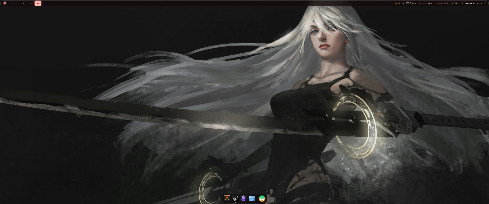
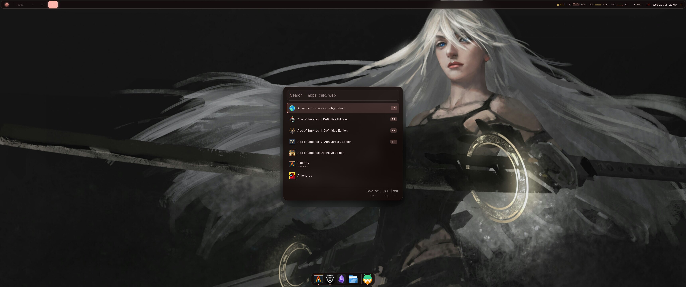
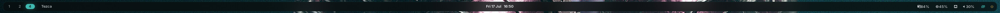

<h1 align="center">Tezca</h1>

<p align="center">
  <em>An elegant, performance-first Hyprland desktop environment.</em><br>
  <strong>Obsidian aesthetic · Rust core · CSS soul · NVIDIA-native.</strong>
</p>

<p align="center">
  <a href="https://github.com/hivezga/tezca/actions/workflows/ci.yml"></a>
  <a href="LICENSE"></a>
</p>

<p align="center">
  
</p>

---

**Tezca** (← *Tezcatlipoca*, the Aztec god of the obsidian **smoking mirror**) is a
curated, macOS-15-inspired Hyprland desktop tuned to be correct and buttery on
**NVIDIA + dual-165 Hz** out of the box, beautiful through a single
wallpaper-driven theme engine, and built around a small **Rust core** so it stays
maintainable.

It's opinionated on purpose — not a pile of dotfiles, but a cohesive DE for
**gaming · AI · dev · hanging out**.

> Full rationale, decisions, and roadmap live in [`docs/DESIGN.md`](docs/DESIGN.md).

## Aesthetic — the "Smoking Mirror"

- **Obsidian** — deep near-black base, volcanic-glass surfaces.
- **Mirror** — translucency, blur, subtle sheen (macOS Sequoia glass).
- **Smoke** — soft graded greys, gentle shadows, nothing hard-edged.
- **Accent** — turquoise/jade `#3FB8AF`, used sparingly, with obsidian-gold secondary.

## Gallery

<p align="center">
  
</p>
<p align="center">
  
</p>

> The bar shot above predates `tezca-bar` (it is the Waybar layout it replaced), so it
> is missing the sparklines, now-playing widget, and glass popovers. Due a retake.

## Highlights

- **NVIDIA-correct session** — uwsm-managed env, explicit sync, `nvidia_drm.modeset`,
  fullscreen VRR, per-monitor workspaces on dual 165 Hz. `tezca doctor` verifies it all.
- **One wallpaper drives every color** — [matugen](https://github.com/InioX/matugen)
  extracts a Material-You palette and re-skins the bar, swaync, Walker, Alacritty,
  Hyprland borders, and the lock screen live — no restarts, no hand-syncing hex codes.
- **`tezca-bar`** — a bespoke **Rust + GTK4 + layer-shell** top menubar replacing
  Waybar: inline CPU/MEM/GPU sparklines, an MPRIS now-playing widget, a system tray,
  per-output workspaces, and glass popovers for the clock, mixer, and network. Adaptive
  per monitor — the ultrawide shows the full cluster, a narrower screen tightens.
- **`tezca-dock`** — a bespoke **Rust + GTK4** magnifying macOS dock (cosine
  magnification, glass blur, running dots, autohide).
- **`tezca-settings`** — a GTK4 control center for themes, displays, wallpaper, the
  desktop, keybinds, gaming, and the session. It shells out to `tezca` for every
  action, so the GUI and your keybindings drive identical code paths.
- **Custom bar modules** — drop a `<name>.toml` in `~/.config/tezca-bar/modules/` with
  an `exec` and it becomes a widget, Waybar-style (plain text or a
  `{"text","tooltip","class"}` JSON subset). Each runs on its own thread with a
  timeout and an output cap, so a wedged script can't stall the bar or grow its memory.
- **Gaming & AI profiles** — `tezca game` flips blur/animations off + tearing on;
  a dedicated AI workspace with Claude launchers and a drop-down Claude Code terminal.
- **AI usage at a glance** — an opt-in bar module showing how much of your Claude
  (or Codex) rate-limit window is left, plus today's local token spend. Private by
  construction: no credential is ever stored, the token never touches a command
  line, hosts are allowlisted in source, and `ai_live = false` makes it fully
  offline. See [`ai.rs`](crates/tezca-bar/src/ai.rs) for the full posture.
- **Non-destructive, and it stays out of your way** — `tezca link` backs up whatever
  was already there, and your settings live *outside* this checkout, so `git pull`
  never conflicts with them. Your previous session (KDE, …) stays selectable at login.

## Install

Targets **Arch / CachyOS** with `paru` and a Rust toolchain, on a
uwsm + Hyprland session.

```sh
git clone https://github.com/hivezga/tezca ~/tezca
cd ~/tezca
./install.sh
```

`install.sh` installs packages via `paru`, builds the four binaries (`tezca`,
`tezca-bar`, `tezca-dock`, `tezca-settings`), runs the test suite before putting
anything on `PATH`, and calls `tezca link` to put `config/*` in place —
**backing up anything that's already there**. Non-destructive and re-runnable.

Then:

```sh
tezca doctor      # verify NVIDIA env, modeset, monitors, deps, config validity
```

Log out and pick the **Hyprland (uwsm-managed)** session at your display manager.
Your previous desktop stays selectable as a fallback the whole time.

### Where your settings live

The repo is *input*: it is symlinked into `~/.config`, so `git pull` updates your
desktop with no re-link step. Anything you or the tools **write** is *output* and
lives outside the checkout, so pulling never conflicts with your own tweaks:

| Path | Written by |
|---|---|
| `~/.config/tezca/local.conf` | `tezca hypr set`, `tezca display set`, the Settings sliders |
| `~/.config/tezca/keybinds.conf` | `tezca keybind` — an override layer; the shipped map is never edited |
| `~/.config/tezca-bar/` | `tezca bar set`, plus your custom module manifests |
| `~/.config/tezca-dock/` | `tezca dock set` |

All four are safe to delete: you get the shipped defaults back. `tezca link` seeds
them and migrates an older install.

## The `tezca` CLI

The DE's control surface — a single dependency-free Rust binary. Every subcommand
takes `--help`.

| Command | Does |
|---|---|
| `tezca link` | put `config/*` in place under `~/.config` (backs up existing; `--dry-run` previews) |
| `tezca doctor` | verify NVIDIA env, modeset, monitors, dependencies, config validity |
| `tezca theme list \| names \| set <name> \| wallpaper  \| reload` | wallpaper-driven theming |
| `tezca bar status \| start \| stop \| restart \| toggle \| config \| set` | control the top menubar |
| `tezca dock status \| start \| stop \| restart \| toggle \| config \| set` | control the magnifying dock |
| `tezca display list \| set <name> … \| reset <name> \| brightness <name> [0-100]` | per-monitor mode/scale/position (live + persisted) + DDC/CI brightness |
| `tezca wallpaper set  --monitor <name> \| clear \| list \| apply` | per-monitor wallpaper overrides (global image → `tezca theme`) |
| `tezca hypr get \| set <opt> <val>… \| reset \| list` | live Hyprland option tuning that persists across reloads |
| `tezca keybind list \| rebind --line N … \| set-action --line N … \| restore \| reset` | inspect + rebind keybindings safely |
| `tezca game status \| on \| off \| toggle \| run -- <cmd>` | gaming profile (tearing, blur off, MangoHud) |
| `tezca settings` | open the GTK control center |

Every write is atomic (temp file → `fsync` → `rename`), every value that lands in a
config line is validated first, and `reset` / `restore` undo it — a bad value never
costs you the session. See [`docs/DESIGN.md §8`](docs/DESIGN.md).

## Theming

Five curated palettes — one obsidian base, one accent per Tezcatlipoca direction —
plus dynamic extraction from any image:

```sh
tezca theme wallpaper ~/Pictures/some.jpg   # dynamic — extract a palette from any image
tezca theme set obsidian                    # the signature smoking mirror — turquoise/jade
tezca theme set xipe                        # Xipe Totec — east · dawn · war (red)
tezca theme set huitzilopochtli             # south · sun · will (blue)
tezca theme set quetzalcoatl                # west · wind · wisdom (white)
tezca theme set smoke                       # the soft light variant — pale smoke, deep jade
```

Every component `@import`s / `source`s a stable path
(`~/.config/tezca/current/colors.*`) and never hardcodes a color, so switching a
theme re-renders those files and sends each app its live-reload signal — `tezca-bar`
`SIGUSR2`, swaync `--reload-css`, `hyprctl reload`, the dock `SIGUSR2`, wallpaper
via `awww`. Alacritty needs no signal (`live_config_reload` watches the imported
palette); Walker is restarted, since a resident service has neither. No visible
restarts. See [`templates/README.md`](templates/README.md) for the token contract.

## Keybindings

A **HyDE-style layout** (mirrors [HyDE's map](https://github.com/HyDE-Project/HyDE/blob/master/KEYBINDINGS.md)) so muscle memory transfers, with Tezca's own actions clustered on `SUPER + ALT`. `SUPER` is the modifier (macOS `⌘`). The always-current, self-documenting cheat-sheet is **`SUPER + /`** — or the **Keybinds** tab in `tezca settings`.

Rebinding from Settings (or `tezca keybind rebind`) writes an override layer to
`~/.config/tezca/keybinds.conf`; the shipped map is never edited, so upstream changes
keep flowing and `tezca keybind reset` puts everything back.

**Apps & launchers**

| Key | Action |
|---|---|
| `SUPER + A` · `SUPER + Space` | application finder (Walker) |
| `SUPER + T` / `Return` | terminal (Alacritty) |
| `SUPER + E` / `SHIFT + E` | file manager · file finder |
| `SUPER + C` / `B` | text editor (code) · browser (Brave) |
| `SUPER + Tab` / `V` / `,` / `.` | window switcher · clipboard · emoji · glyph |
| `SUPER + /` · `SUPER + SHIFT + A` | keybind cheat-sheet · **control center** |

**Windows & workspaces**

| Key | Action |
|---|---|
| `CTRL + Q` / `ALT + F4` | close window |
| `SUPER + W` / `F` / `SHIFT + F` | float / fullscreen / pin |
| `SUPER + arrows` | move focus · `SHIFT +` resize · `CTRL + SHIFT +` move |
| `SUPER + G` / `J` | toggle group / split |
| `SUPER + 1…0` | workspace · `SHIFT +` move (follow) · `ALT +` move (silent) |
| `SUPER + S` · `SUPER + ALT + T` | scratchpad · drop-down terminal |

**Theming, capture & session**

| Key | Action |
|---|---|
| `SUPER + SHIFT + W` / `T` | select wallpaper / theme · `SUPER + ALT + ←/→` cycle wallpaper |
| `SUPER + P` / `ALT + P` / `CTRL + P` | snip region · snip window · freeze-snip — all open swappy to annotate |
| `SUPER + SHIFT + ALT + P` / `Print` / `SUPER + SHIFT + P` | snip focused monitor · all monitors → file · color picker |
| `SUPER + L` · `ALT + CTRL + Del` · `SUPER + Del` | lock · power menu · end session |
| media / brightness · `F10 F11 F12` | volume · mute · play · backlight |
| `ALT + Right-Ctrl` | hide / show the menubar |

**Tezca signature (`SUPER + ALT`)**

| Key | Action |
|---|---|
| `SUPER + ALT + A` / `SHIFT + A` | AI drop-down terminal · spawn Claude Code |
| `SUPER + ALT + C` · `SUPER + N` | Claude desktop · quick-note |
| `SUPER + ALT + D` · `SUPER + D` | pin / unpin the dock |
| `SUPER + ALT + G` | toggle gaming mode |

## Component stack

**tezca-bar** (Rust menubar) · **tezca-dock** (Rust dock) · **tezca-settings** (Rust
control center) · Walker (launcher) · swaync (notifications) · hyprlock + hypridle
(lock/idle) · wlogout (power) · matugen (theme engine) · awww (wallpaper) · Alacritty
(terminal) · cliphist · hyprshot + swappy (snip + annotate) · hyprpicker.
Waybar and kitty stay in the repo as documented fallbacks.
NVIDIA env lives in uwsm's `env` / `env-hyprland`. Rationale for each choice is in
[`docs/DESIGN.md §5`](docs/DESIGN.md).

## Layout

```
config/       → symlinked into ~/.config (hypr, uwsm, waybar, swaync, walker, alacritty, …)
              → except tezca-bar/ and tezca-dock/, which are seeded into real
                directories: they hold settings you and the tools write, so they
                must not live inside the checkout
crates/       the Rust core — tezca-cli (`tezca`) · tezca-bar · tezca-dock · tezca-settings
themes/       five curated palettes — obsidian · xipe · huitzilopochtli · quetzalcoatl · smoke
templates/    matugen templates → ~/.config/tezca/current/colors.*
wallpapers/   default wallpapers (see wallpapers/CREDITS.md)
docs/         DESIGN.md + screenshots
install.sh    bootstrap: deps → build → test → link
```

## Development

```sh
cargo test --workspace                              # 97 tests
cargo clippy --workspace --all-targets -- -D warnings
```

CI runs both on every branch, split into a std-only `tezca-cli` job (no system
dependencies) and a GTK job for the three gtk4-rs binaries — see
[`.github/workflows/ci.yml`](.github/workflows/ci.yml). The tests cover the logic that
can damage a session: the Hyprland managed-block rewriting, the keybind override
layer, `tezca link`'s symlink/seed/backup decisions, input validation, atomic writes,
and in the bar the custom-module timeout and the incremental log reader.

## Status

Built and verified on the target hardware (Ryzen 7 5800X3D · RTX 4070 Ti
`nvidia-open` · 3440×1440@165 + 2560×1440@165). All seven roadmap phases are done —
bootable NVIDIA-tuned session → aesthetic core → theme engine → dock & polish → the
Rust `tezca-dock` → gaming/AI profiles → share — plus the post-roadmap work that
replaced Waybar with `tezca-bar` and added the control center. See the
[roadmap](docs/DESIGN.md#13-roadmap-phased-each-phase-independently-usable).

## Credits

Wallpaper terms — including the third-party signature `obsidian` image — are listed
in [`wallpapers/CREDITS.md`](wallpapers/CREDITS.md). The bundled `smoke` wallpaper is
generated for Tezca and MIT-licensed like the rest of the project.

## License

[MIT](LICENSE). Bundled wallpapers carry their own terms — see
[`wallpapers/CREDITS.md`](wallpapers/CREDITS.md).
